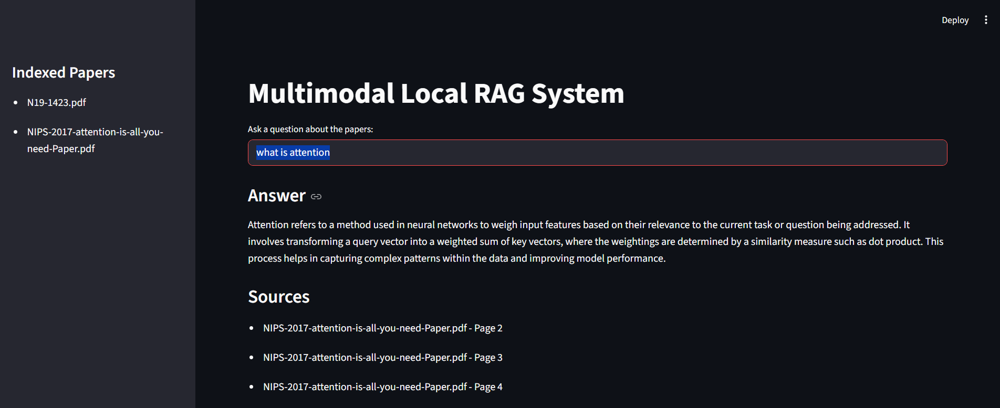
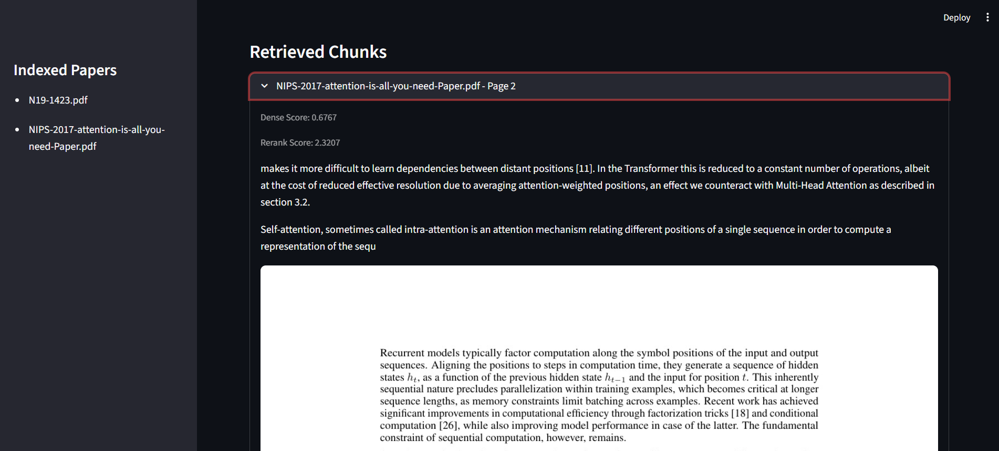
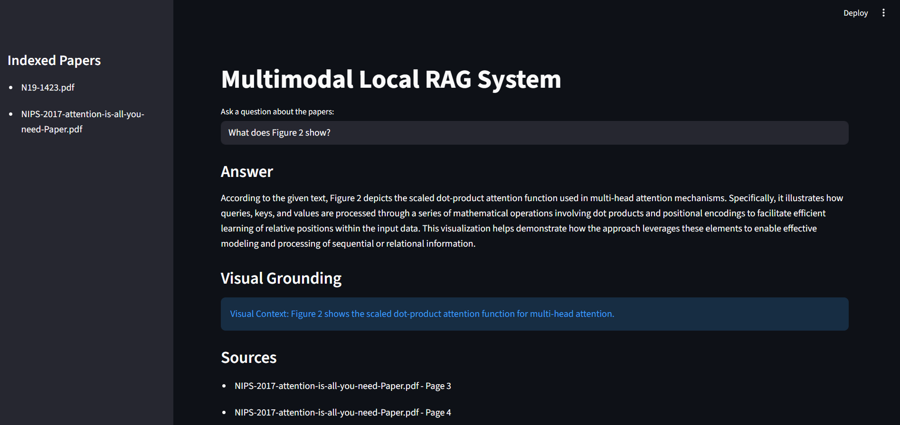
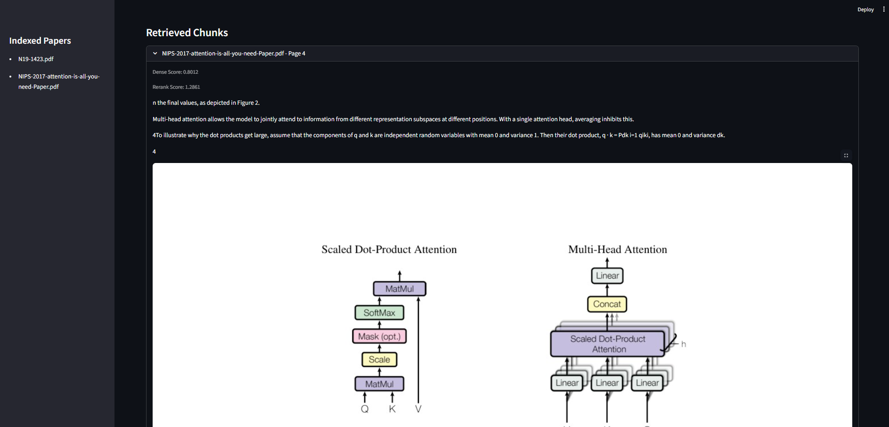

# Multimodal Local RAG System

A fully local Retrieval-Augmented Generation (RAG) system for querying research papers using semantic retrieval, reranking, and multimodal-ready page grounding.

The system processes PDF research papers, builds a FAISS vector database over extracted text chunks, retrieves relevant contexts using dense embeddings, reranks them using a cross-encoder, and generates grounded answers using a local language model.

All inference runs locally without paid APIs.

---

# Features

- Fully local inference pipeline
- PDF text extraction using PyMuPDF
- Recursive chunking with overlap
- Dense semantic retrieval using FAISS
- Cross-encoder reranking
- Local LLM-based answer generation
- Multimodal-ready architecture with rendered page grounding
- Streamlit-based interactive UI
- Explainable retrieval with retrieved chunks and source pages
- No external API dependency

---

# System Architecture

```text
PDF Papers
    ↓
Document Processing
    ↓
Chunking
    ↓
Embeddings Generation
    ↓
FAISS Vector Store
    ↓
Retriever
    ↓
Reranker
    ↓
Local LLM (Qwen)
    ↓
Answer Generation
```

Optional multimodal support:
- Retrieved chunks maintain linkage to rendered PDF page images
- Architecture supports visual grounding through Moondream2
- Visual model inference disabled by default to reduce slow response times on CPU-only systems

---

# Tech Stack

| Component | Technology |
|---|---|
| UI | Streamlit |
| Vector Database | FAISS |
| Embeddings | BAAI/bge-small-en-v1.5 |
| Reranker | cross-encoder/ms-marco-MiniLM-L-6-v2 |
| Text LLM | Qwen |
| VLM | Moondream2 |
| PDF Processing | PyMuPDF |
| Backend | Python |

---

# Project Structure

```text
multimodal-local-rag/
│
├── app/
│   └── streamlit_app.py
│
├── data/
│   ├── papers/
│   └── faiss_index/
│
├── src/
│   ├── __init__.py
│   ├── chunker.py
│   ├── config.py
│   ├── document_processor.py
│   ├── embedder.py
│   ├── generator.py
│   ├── rag_pipeline.py
│   ├── retriever.py
│   ├── vector_store.py
│   └── vlm.py
│
├── build_index.py
├── requirements.txt
├── README.md
└── .gitignore
```

---

# How the System Works

## 1. Document Processing

PDF papers are processed using PyMuPDF:
- text is extracted page-by-page
- each page is rendered into an image
- metadata is preserved for retrieval grounding

---

## 2. Chunking

Extracted text is split into overlapping chunks to:
- preserve semantic continuity
- improve retrieval quality
- reduce context fragmentation

---

## 3. Embedding Generation

Each chunk is converted into dense vector embeddings using:

```text
BAAI/bge-small-en-v1.5
```

These embeddings represent semantic meaning numerically.

---

## 4. FAISS Vector Index

Embeddings are stored locally inside a FAISS vector database for:
- efficient similarity search
- scalable retrieval
- low-latency querying

---

## 5. Retrieval and Reranking

The pipeline performs:
1. Dense retrieval using cosine similarity
2. Cross-encoder reranking for relevance refinement

This improves retrieval accuracy significantly compared to single-stage retrieval.

---

## 6. Answer Generation

Top retrieved chunks are passed into a local Qwen language model to generate grounded answers.

Retrieved source chunks and corresponding pages are displayed in the UI for explainability.

---

# How to Read the Code

| File | Purpose |
|---|---|
| `config.py` | Central configuration and paths |
| `document_processor.py` | PDF extraction and page rendering |
| `chunker.py` | Text chunking logic |
| `embedder.py` | Embedding generation |
| `vector_store.py` | FAISS persistence and retrieval |
| `retriever.py` | Dense retrieval + reranking |
| `generator.py` | Local Qwen response generation |
| `rag_pipeline.py` | End-to-end orchestration |
| `vlm.py` | Optional Moondream visual grounding |
| `streamlit_app.py` | Streamlit user interface |

---

# Installation

## 1. Clone Repository

```bash
git clone https://github.com/viharpeddagopu/multimodal-local-rag-system
cd multimodal-local-rag-system
```

---

## 2. Create Virtual Environment

It is strongly recommended to use a clean virtual environment to avoid dependency conflicts with existing global or Conda-installed packages.

```bash
python -m venv .venv
```

Activate environment:

### Windows

```bash
.venv\Scripts\activate
```

### Linux / Mac

```bash
source .venv/bin/activate
```

---

## 3. Install Dependencies

```bash
pip install --upgrade pip
pip install -r requirements.txt
```
---

# Add Research Papers

2 papers are already added. To test and add new papers,

Place PDF files inside:

```text
data/papers/
```

---

# Build FAISS Index

```bash
python build_index.py
```

This step:
- extracts text
- creates chunks
- generates embeddings
- builds FAISS index
- stores chunk metadata locally

---

# Run Application

```bash
streamlit run app/streamlit_app.py --server.fileWatcherType none
```

---

# Example Query

## Query

```text
What is attention?
```

## Answer

```text
Attention refers to a method used in neural networks to weigh input features based on their relevance to the current task or question being addressed. It transforms query vectors into weighted combinations of key vectors, enabling the model to capture contextual relationships effectively.
```

---

# Screenshots

## Text Query Output



## Retrieved Chunks - Text Query



## Visual Query Output (VLM Grounding)



## Retrieved Chunks - Visual Query



---

# Hardware Notes

- The project is designed primarily for local CPU-based inference
- First-time model downloads may take several GB of storage
- Large local models can increase RAM usage significantly during inference
- Live VLM inference is computationally expensive on CPU-only systems

---

# Troubleshooting

## FAISS Index Not Found

Run:

```bash
python build_index.py
```

before launching the application.

---

## Slow First Startup

The first launch downloads local model weights and initializes:
- embedding models
- rerankers
- local LLMs

Subsequent runs are significantly faster due to caching.

---

## High CPU or RAM Usage

Large local models may consume substantial system memory during inference.

Visual model inference is disabled by default to improve responsiveness on CPU-only systems.

---

# Contact

Vihar Peddagopu  
Email: viharpeddagopu@gmail.com
